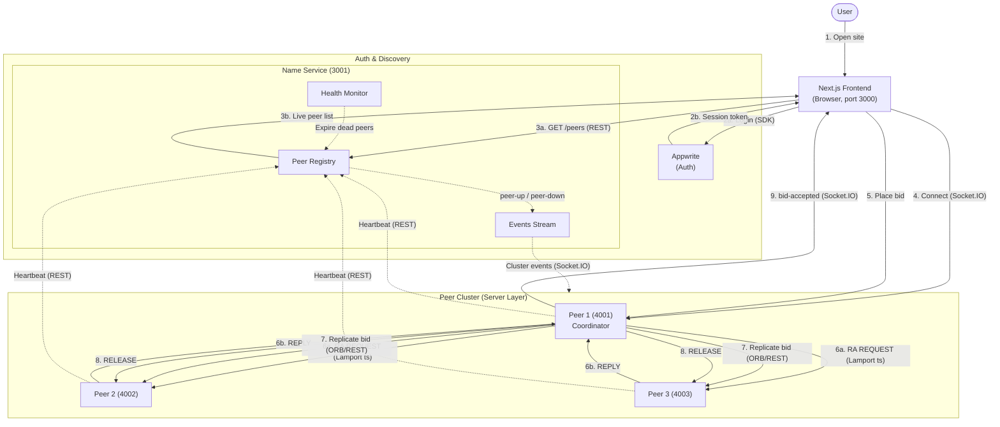

# End-to-End Flow & Course Concepts Used

This document follows a user from opening the website to placing a bid and seeing a winner declared, and tags every step with the distributed-systems course concept it demonstrates.

## Full Flow Diagram

The diagram is laid out in **five tiers top-to-bottom**, following the request path:
**User → Browser → Auth & Name Service → Peer Cluster → Peer ↔ Peer coordination.**

## Step-by-Step Flow with Course Concepts

### 1. User opens the website
- The browser loads the Next.js frontend on port 3000.
- **Course concept:** *Client–Server model* — the browser is a thin client.

### 2. User logs in via Appwrite
- Frontend uses the Appwrite SDK (`lib/appwrite.ts`, `lib/auth-context.tsx`) to authenticate.
- **Course concept:** *Authentication / Security in distributed systems* — session tokens issued by an external identity provider.

### 3. Frontend discovers live peers
- Frontend calls `GET /peers` on the Name Service (port 3001).
- **Course concepts:**
  - *Name Service / Service Discovery* — central directory that decouples clients from physical server addresses.
  - *Transparency (location)* — the client doesn't hard-code peer URLs.

### 4. Frontend connects to a peer over Socket.IO
- The browser opens a persistent WebSocket-based channel to one peer.
- **Course concepts:**
  - *Event-driven / push-based communication* (vs. polling).
  - *Middleware* — Socket.IO acts as message-oriented middleware between client and server.

### 5. User places a bid
- Bid is sent over the Socket.IO connection to the peer.
- **Course concept:** *Remote invocation* via the **ORB layer** (`orb.ts`, `orb-client.ts`) — an Object Request Broker abstraction over REST + Socket.IO.

### 6. Peer requests mutual exclusion before mutating shared state
- The receiving peer runs **Ricart–Agrawala** (`ricartAgrawala.ts`): broadcasts `REQUEST` to all peers, waits for `REPLY` from all.
- Every message carries a **Lamport timestamp** (`lamportClock.ts`).
- **Course concepts:**
  - *Distributed Mutual Exclusion — Ricart–Agrawala algorithm.*
  - *Logical Clocks — Lamport timestamps* for total ordering of bid events.

### 7. Peer replicates the new state to other peers
- Once inside the critical section, the peer applies the bid locally and propagates it via `replication.ts` / `stateSync.ts` using ORB/REST.
- **Course concepts:**
  - *Data Replication* — every peer holds the same auction state.
  - *Consistency* — replication is synchronized inside the RA critical section to keep peers consistent.

### 8. Peer releases the critical section
- Sends `RELEASE` to all peers; queued requests can now proceed.
- **Course concept:** *Safety + liveness* of distributed mutex.

### 9. All connected clients receive the bid update
- Each peer pushes `bid-accepted` to its Socket.IO clients.
- **Course concepts:**
  - *Publish/Subscribe* — peers publish events; clients are subscribers.
  - *Transparency (replication)* — clients see one logical auction regardless of which peer they're connected to.

### Background: Heartbeats and failure detection
- Each peer periodically POSTs a heartbeat to the Name Service (`heartbeat.ts`).
- The **Health Monitor** (`healthMonitor.ts`) expires peers that miss heartbeats; the **Events Stream** broadcasts `peer-down`.
- **Course concepts:**
  - *Failure Detection* — heartbeat-based.
  - *Fault Tolerance* — the system continues to operate when a peer dies.

### Background: Coordinator election on failure
- One peer is the **auction coordinator** (`auctionCoordinator.ts`), driving the auction lifecycle (start, close, declare winner).
- If the coordinator fails, the remaining peers deterministically elect the lowest-ID live peer as the new coordinator.
- **Course concepts:**
  - *Coordinator Election* — deterministic lowest-ID rule (a simple election algorithm).
  - *Recovery from coordinator failure.*

## Summary of Course Concepts Demonstrated

| Concept | Where in the system |
|---|---|
| Client–Server model | Browser ↔ peers |
| Peer-to-peer architecture | Symmetric peers replicating state |
| Middleware | Socket.IO + ORB layer |
| Object Request Broker (ORB) | `orb.ts`, `orb-client.ts` |
| Name Service / Service Discovery | `packages/nameservice` |
| Location transparency | Clients discover peers dynamically |
| Replication transparency | Any peer serves any client identically |
| Data Replication | `replication.ts`, `stateSync.ts` |
| Logical Clocks (Lamport) | `lamportClock.ts` |
| Distributed Mutual Exclusion (Ricart–Agrawala) | `ricartAgrawala.ts` |
| Coordinator Election | `auctionCoordinator.ts` (lowest-ID rule) |
| Failure Detection (heartbeats) | `heartbeat.ts`, `healthMonitor.ts` |
| Fault Tolerance / Recovery | Coordinator re-election, peer-down events |
| Publish/Subscribe | Socket.IO event broadcasts |
| Authentication | Appwrite session tokens |
