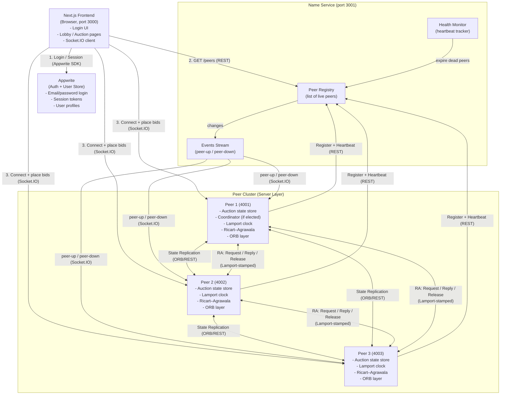

# System Architecture (Simple View)

## Components

- **Next.js Frontend (Browser, port 3000)** — Renders login, lobby, and auction pages. Authenticates the user via the Appwrite SDK, queries the Name Service over REST to discover live peers, then connects to a peer via Socket.IO to place bids and receive live auction updates.
- **Appwrite (Auth + User Store)** — External service that handles email/password login, issues session tokens, and stores user profiles. Used only by the frontend.
- **Name Service (port 3001)** — Central directory of the peer cluster. Made of three parts:
  - **Peer Registry** — keeps the current list of live peers (id, URL).
  - **Health Monitor** — tracks heartbeats and removes peers that miss them.
  - **Events Stream** — pushes `peer-up` / `peer-down` notifications to peers and clients.
- **Peer Cluster (ports 4001–4003)** — Symmetric Express + Socket.IO servers. Each peer holds the full auction state and runs:
  - **Auction Coordinator** — one elected peer drives the auction lifecycle (start, bidding, close, declare winner).
  - **State Replication** — synchronizes the auction store across peers so any peer can serve any client.
  - **Lamport Clock** — logical timestamps stamped on every outgoing message for total ordering.
  - **Ricart–Agrawala** — distributed mutual exclusion (`Request` / `Reply` / `Release`) before mutating shared state.
  - **ORB Layer** — REST + Socket.IO abstraction used for all remote calls (peer ↔ peer and client ↔ peer).

## Communication Flows

1. **Client → Appwrite (SDK):** User logs in, receives a session token.
2. **Client → Name Service (REST):** Frontend fetches the list of live peers.
3. **Client → Peer (Socket.IO):** Frontend opens a real-time connection to one peer to subscribe to auction events and submit bids.
4. **Peer → Name Service (REST):** Each peer registers on startup and sends periodic heartbeats.
5. **Name Service → Peers / Clients (Socket.IO events):** Broadcasts `peer-up` / `peer-down` when the cluster changes.
6. **Peer ↔ Peer (ORB / REST):** Replicate and synchronize the auction store so every peer has the same state.
7. **Peer ↔ Peer (RA messages, Lamport-stamped):** `REQUEST` / `REPLY` / `RELEASE` to serialize critical sections (e.g., accepting a bid, closing an auction).
8. **Coordinator Peer → Other Peers:** Drives the auction lifecycle and propagates results to all peers, which fan out to connected clients via Socket.IO.
