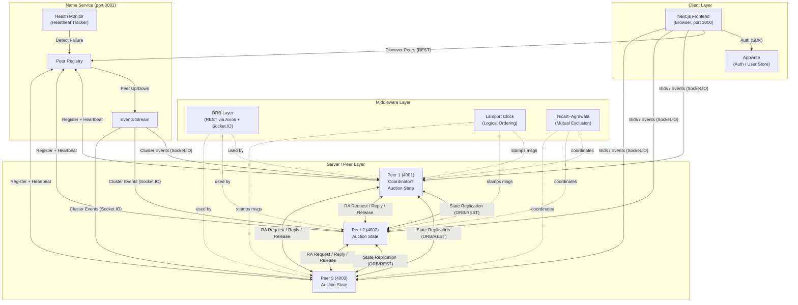

# System Architecture

The proposed project must include a well-defined system architecture diagram that accurately represents the roles of components (clients, servers/peers, middleware, name service) and the communication flows between them.

## Architecture Diagram

## Component Roles

- **Next.js Frontend (`packages/frontend`)** — Browser client (port 3000). Authenticates users through Appwrite, discovers live peers from the Name Service, and opens a Socket.IO connection to a peer to place bids and receive auction updates in real time.
- **Appwrite** — External auth provider and user store used by the frontend SDK (`lib/appwrite.ts`, `lib/auth-context.tsx`).
- **Name Service (`packages/nameservice`, port 3001)** — Central directory of live peers. Holds the peer **registry**, runs a **health monitor** that expires peers missing heartbeats, and emits cluster **events** (peer up/down) to subscribed peers and clients.
- **Peers (`packages/peer`, ports 4001–4003)** — Symmetric application servers that hold the replicated auction state. Each peer:
  - Registers with the Name Service and sends periodic heartbeats (`heartbeat.ts`).
  - Runs an **auction coordinator** (`auctionCoordinator.ts`) — one elected peer drives auction lifecycle.
  - Replicates state to other peers (`replication.ts`, `stateSync.ts`).
  - Serializes critical sections with **Ricart–Agrawala** mutual exclusion (`ricartAgrawala.ts`) using **Lamport clocks** (`lamportClock.ts`).
- **Middleware (in-process, per peer)**:
  - **ORB layer** (`orb.ts`, frontend `lib/orb-client.ts`) — REST/Socket.IO abstraction for remote invocation between peers and from clients.
  - **Lamport clock** — Logical timestamps on every outgoing message.
  - **Ricart–Agrawala** — Distributed mutual exclusion before mutating shared auction state.

## Communication Flows

1. **Client → Appwrite:** Authenticate user, retrieve session.
2. **Client → Name Service (REST):** Fetch the list of live peers.
3. **Client → Peer (Socket.IO):** Subscribe to auction events; submit bids.
4. **Peer → Name Service (REST):** Register on startup; send periodic heartbeats.
5. **Name Service → Peers/Clients (Socket.IO events):** Broadcast `peer-up` / `peer-down` cluster changes.
6. **Peer ↔ Peer (ORB/REST):** State replication and synchronization of the auction store.
7. **Peer ↔ Peer (RA messages):** `REQUEST` / `REPLY` / `RELEASE` for mutual exclusion, stamped with Lamport timestamps.
8. **Coordinator Peer → Peers:** Drives auction lifecycle (start, close, declare winner) and propagates results.
